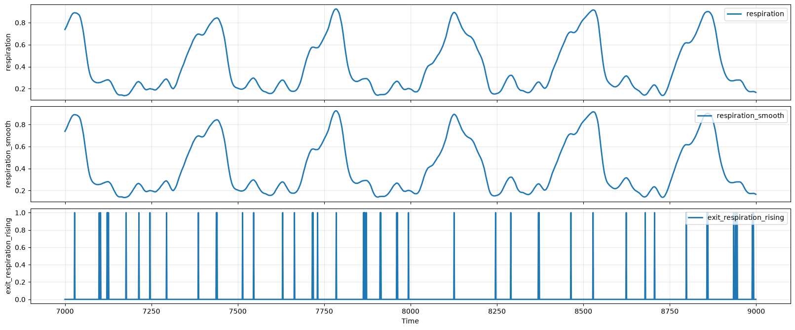
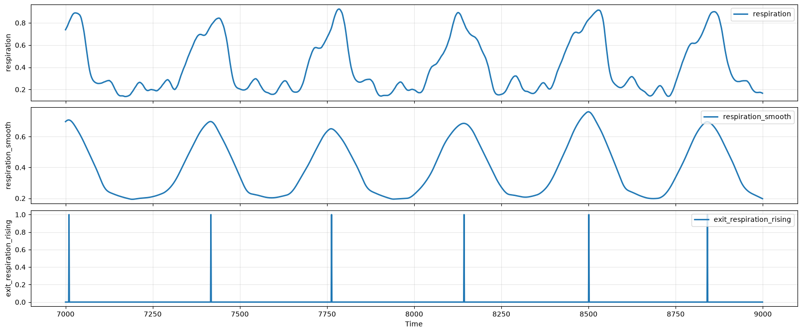

## Structural, Analytical, and Scientific Understanding: A Compiler-Level Account of Smoothing-Parameter Choice

Nazia Habib

September 2026

### Section 1: Time-series waveform construction using multiple-scale parameters

Time-series studies commonly mix preprocessing choices and scientific interpretation into a single analysis. In preprocessing, these studies often reduce agreement between two computational methods to a single summary score. This makes it difficult to locate individual disagreements, determine how they arise, or test whether discordant events form a homogenous error category.

Respiratory waveforms contain structure at multiple temporal scales, and changing the temporal scale of a representation can alter which signal reversals are preserved and which waveform objects are constructed. In this study, a waveform object is a bounded trough-peak-trough or peak-trough-peak interval constructed from ordered rising, falling, and inactive states.

Even within a single deterministic construction, changing one temporal-scale parameter can produce different boundaries and waveform object identities. The resulting unmatched objects may expose organized signal structure that is not preserved at another temporal scale.

### Section 2: FeatureGraph as deterministic automated construction of time-series waveform objects

FeatureGraph is a deterministic representation framework for constructing explicit behavioral objects from ordered time-series observations. In this study, the behavior is oscillatory, and the objects we produce are waveform objects. FeatureGraph classifies waveform samples as rising, falling, or inactive, marks the boundaries where those states begin and end, and composes ordered state transitions into explicit trough-peak-trough or peak-trough-peak objects.

While many parts of the data analysis process can be automated, the automation software should execute rather than determine the scientific rules of the analysis. Within FeatureGraph, the researcher supplies the representation, validation, and comparison rules, FeatureGraph applies those rules deterministically, and the scientific meaning of the resulting objects remains a matter for investigation. Preserving this division of roles makes it possible to report which decisions were made by the researcher, what was automated by the software, and what scientific interpretations were supported by the resulting evidence.

### Section 3: Scientific justification of waveform-smoothing parameters

We often think of preprocessing as a kind of data-cleaning chore that we have to carry out before we can do the real analysis. Wave-smoothing is often placed in this category, and its thresholds are often left unjustified, chosen because they produce the result we already expected.

Smoothing should instead be treated as an important step in the specification of our analysis, a question about what data, what intervals, and what representation we are trying to construct. Obtaining a desired result is not by itself a scientific justification for a parameter. We must explain:

- what variation the threshold is intended to suppress
- what variation it is intended to preserve
- why that distinction is appropriate for the phenomenon under study.
  
It is insufficient to say "I am smoothing this wave to get rid of noise" without having a disciplined justification for what noise is. Beyond agreed-upon categories like sensor artifacts, we may define noise as the fluctuations we are not interested in, but this definition risks becoming circular if we choose a parameter because it produces the results we expected such as a visually clean curve or the number of events we anticipated.

Smoothing parameters should not be chosen to match an expected result. They should be chosen to specify in advance the phenomena we do and do not want to observe. In effect, smoothing defines the observational scale of the analysis, stating: "only waveform objects whose amplitude exceeds this height count" or "only fluctuations lasting at least this long count."

### Section 4: The three-level and P/D/O/M/S classifications

In any data analysis, "understanding the data" is often treated as one indivisible skill. We can instead split understanding into three levels:

1. Structural understanding - what each file, column, timestamp, label, and annotation represents, and how individual records relate to one another.
2. Analytical understanding - what should be grouped, measured, compared, and checked to answer a defined question.
3. Scientific or domain understanding - what the results mean. Specifically what they mean physically, clinically, or operationally, and which conclusions they justify.

FeatureGraph is built to provide the first two. By separating structural and analytical understanding from domain-specific scientific interpretation, it can represent data across fields and expose patterns shared by otherwise unrelated datasets. 

The remainder of this discussion rests on a five-part classification, developed as part of FeatureGraph's compiler/representation-language formalization:

1. P - compiler primitive (sign-test operations that classify a signal as rising, falling, or inactive)
2. D - declarative definition (smoothing window and other parameters a researcher specifies before computation)
3. O - compiled output (resulting states, boundaries, and waveform object identities)
4. M - measurement (quantities computed from O, such as duration, period, or correlation statistics)
5. S - scientific interpretation (which waveform objects reflect the phenomenon under study).
   
This extends the three-level distinction introduced above into a five-part classification, structural understanding corresponds to P (compiler primitives) and O (compiled output); analytical understanding corresponds to D (declarative definitions) and M (measurements); and scientific understanding corresponds to S (scientific interpretation).

This full P/D/O/M/S classification, and its application beyond this single illustrative case, is developed in FeatureGraph's compiler and representation-language formalization; this discussion presents one concrete instance of the general claim.

### Section 5: Methods and data

All analyses use the BIDMC PPG and Respiration Dataset, available via PhysioNet. The dataset comprises 53 recordings, each an 8-minute segment, sampled at 125 Hz. Only the impedance-derived respiration signal is used in this study.

Waveform objects are constructed using the state-detection logic underlying FeatureGraph's Oscillation representation. For a given smoothing window W, specified in samples, the raw respiration signal is smoothed with a rolling median filter of length W, followed by a rolling mean filter of the same length, both centered. The smoothed signal is classified sample-by-sample as rising, falling, or inactive based on the sign of its first difference. A waveform object is bounded by successive peaks (transitions into a falling state), with the trough (transition into a rising state) that falls between them separating each object's falling and rising phases. The construction is applied identically across all subjects; the only parameter that changes is W.

Single-recording illustration: One recording (subject 1) is examined at two window lengths, W=1 (effectively unsmoothed) and W=100, over an 8-minute segment. Waveform object boundaries and counts are compared directly between the two constructions.

Population analysis: The same comparison, waveform object count at W=1 versus W=100, is repeated independently for each of the 53 subjects in the cohort, using the identical construction and no other change in parameters. For each subject, the two window lengths' counts are recorded, and the population-level relationship between them is summarized by the Pearson correlation coefficient across all 53 subjects and by the range of the per-subject ratio (W=1 count divided by W=100 count).

Signal-derived construction. For the human-annotation comparison below, each subject's respiration signal is characterized independently via autocorrelation, yielding an estimated period and a confidence flag; for confident subjects, a smoothing window is derived from that subject's own estimated period, and the construction described above is applied using that subject-specific window rather than a single window fixed across the cohort. This is the same characterization method discussed in Section 7.

Human annotation comparison. For a subset of 32 BIDMC subjects, two independent expert annotations of respiratory-cycle timing are available. These are the subjects labeled confident under the characterization above, with five subjects showing structurally anomalous respiration additionally excluded. Constructed peaks, from the signal-derived construction above, are matched against annotated peaks using nearest-neighbor matching within a fixed tolerance window; recall is reported at three tolerances (0.25 s, 0.5 s, 1.0 s). Matching is performed against the annotated peak phase, the phase both annotators used; matching against the trough phase instead, with all other parameters unchanged. Phase alignment is a construction decision with the same character as the smoothing-window choice examined above: an unstated or incorrect phase produces near-total apparent disagreement despite an unchanged signal and construction.

For the CapnoBase capnography dataset, a single expert annotation is available per recording, with no second annotator to establish an independent agreement ceiling. The same matching procedure, at the same three tolerances, is applied without modification to the underlying construction.

All analyses were performed using the state-detection logic underlying FeatureGraph's Oscillation representation, implemented in Python.

### Section 6: Results: single-recording illustration and population analysis

We examine a single BIDMC respiration recording (subject 1, an 8-minute segment). Applying a rolling median-then-mean smoothing filter followed by rising/falling state detection at two different window lengths (W) produces two different accounts of the same segment. At W=100, the smoothed signal traces six clean, well-separated waveforms, evenly spaced across the segment. At W=1, effectively no smoothing, the same construction applied to the same raw signal detects considerably more events. Small secondary rises and falls each register as their own waveform object, producing clusters of 2-3 events where W=100 detects one.

Figure 1. The same 8-minute BIDMC respiration recording (subject 1, t=7000–9000), processed by the identical construction — rolling median-then-mean smoothing followed by rising/falling state detection — at two window lengths. (Left, W=1) Effectively no smoothing; respiration_smooth closely tracks the raw signal, and small secondary fluctuations within each breath each register as their own waveform object, producing dense clusters of 2–3 exit_respiration_rising events per breath. (Right, W=100) The same construction with a larger window; respiration_smooth traces a single clean envelope per breath, and exit_respiration_rising fires exactly once per breath, six times across the segment. No parameter other than the smoothing window differs between the two panels.

Both windows are the result of the same procedure, applied faithfully, with one parameter changed. The disagreement is not an error in either construction; it is the mechanical consequence of smoothing determining what considers meaningful signal and what should be removed as noise. When we change the smoothing specification, every downstream count changes with it, without either construction becoming incorrect.

This is not unique to a single BIDMC recording. Repeating the waveform object count comparison at W=1 vs W=100, using the identical construction across the full 53-subject BIDMC cohort, the population correlation between the two window choices is 0.39, and the ratio between them ranges from 1.14x to over 40x depending on the subject. The fact that the two waveform object counts bear little relationship to each other suggests that both encode different definitions of what constitutes signal and what constitutes noise, and that examining the signal from the outside without a stated domain purpose cannot adjudicate between them.

Where BIDMC provides two independent annotators for a subset of subjects, their agreement with each other establishes a ceiling on how closely any single method, including the construction above, can be expected to agree with either one. Table 1 reports recall against each annotator alongside this inter-annotator ceiling, at three matching tolerances.

**Table 1.** BIDMC recall against each of two independent expert annotators, and the annotators' agreement with each other, at three tolerances (N=32).

| Tolerance | Recall (annotator 1 / annotator 2) | Inter-annotator ceiling |
|---|---|---|
| 0.25 s | 84.2% / 80.6% | 89.6% |
| 0.5 s | 94.4% / 96.2% | 95.9% |
| 1.0 s | 95.8% / 99.1% | 97.9% |

At every tolerance, recall against each annotator falls close to the inter-annotator ceiling rather than substantially below it.

CapnoBase provides one annotator per recording rather than two, so no independent ceiling can be computed there; Table 2 reports recall and precision against that single annotation, bearing on whether the construction transfers to a second signal domain rather than on its accuracy.

**Table 2.** CapnoBase recall and precision against a single expert annotation, at three tolerances.

| Tolerance | Recall / Precision |
|---|---|
| 0.25 s | 41.4% / 41.3% |
| 0.5 s | 68.5% / 68.4% |
| 1.0 s | 97.3% / 97.4% |

The same construction, applied without retuning to a different signal domain, approaches the single annotator's labels at wider tolerances.

### Section 7: FeatureGraph's role in parameter selection

Peak-detection and smoothing-parameter sensitivity arises in fields adjacent to respiratory waveform construction. In ECG R-peak detection, fixed decision thresholds are documented to fail under changing signal amplitude, missing low-amplitude peaks or producing extended detection gaps after anomalous beats, requiring threshold-adjustment rules to compensate (Imtiaz & Khan, 2022). In EEG sleep-spindle detection, automated methods rely on fixed numeric thresholds across several signal features, and different detectors, or a detector compared against human expert scoring, typically show only moderate agreement (Lacourse et al., 2019). In both fields, this sensitivity is usually treated as a tuning problem, something to be measured against a downstream metric or reference method, rather than as a specification problem requiring its own justification.

FeatureGraph's contribution is first demonstrating the instability due to smoothing parameter construction quantitatively across a real population, and then explicitly using the structural/analytic/scientific three-level separation to decide what automation can and cannot resolve, rather than leaving it as an implicit judgment call of the researcher.

Under the representation-language classification, the instability demonstrated above is a property of D, not of P, O, or M. The primitives classify each sample correctly at any window, the compiled output is internally consistent at any window, and the measurements are computed correctly from any output they are given. What varies is the declaration of the parameter itself, which no inspection of P, O, or M can determine is correct. That determination belongs to S, which includes the parts of the analysis that FeatureGraph explicitly does not automate.

The determination of what should be removed from an oscillation as noise is part of the scientific question being asked, specifically the question "Which of these waveform objects are part of the phenomena I want to observe for this study, and which ones are not?" It is not, under this three-level construction, answerable on the level of structural or analytical knowledge but on the level of scientific or domain understanding.

What FeatureGraph can do as a bootstrap toward this determination is structural, not scientific. It can characterize the signal's own periodicity directly, independent of any smoothing choice, and use that measurement to suggest a principled range of window sizes, along with an explicit flag of when no such suggestion is trustworthy. This narrows the space of defensible smoothing choices to those consistent with the signal's own measured structure, providing a constraint on which smoothing specifications are worth defending.

A second, independent kind of bootstrap is available where multiple human annotations exist. Lacourse et al. (2019) report only moderate agreement between automated EEG spindle detectors and expert human scoring; the BIDMC comparison in Section 6 quantifies the same phenomenon directly, with two independent expert annotators themselves reaching a ceiling of 89.6–97.9% mutual agreement depending on tolerance, and the construction's agreement with either annotator falling close to that ceiling rather than substantially below it. This does not identify which construction, or which annotator, is correct — that remains an S-level determination, per the three-level classification above. It does establish, empirically rather than by assumption, how much disagreement is already present in human judgment before any automated construction is introduced, providing a second, orthogonal constraint alongside signal-derived periodicity: not on which window is defensible, but on how much precision any method, human or automated, can be expected to achieve against another.

### References

BIDMC PPG and Respiration Dataset (version 1.0.0). PhysioNet. https://physionet.org/content/bidmc/1.0.0/

Pimentel, M. A. F., Johnson, A. E. W., Charlton, P. H., Birrenkott, D., Watkinson, P. J., Tarassenko, L., & Clifton, D. A. (2016). Toward a robust estimation of respiratory rate from pulse oximeters. IEEE Transactions on Biomedical Engineering, 64(8), 1914–1923.

Imtiaz, M. N., & Khan, N. (2022). Pan-Tompkins++: A robust approach to detect R-peaks in ECG signals. arXiv preprint arXiv:2211.03171.

Lacourse, K., Delfrate, J., Beaudry, J., Peppard, P., & Warby, S. C. (2019). A sleep spindle detection algorithm that emulates human expert spindle scoring. Journal of Neuroscience Methods, 316, 3–11. https://doi.org/10.1016/j.jneumeth.2018.08.014
